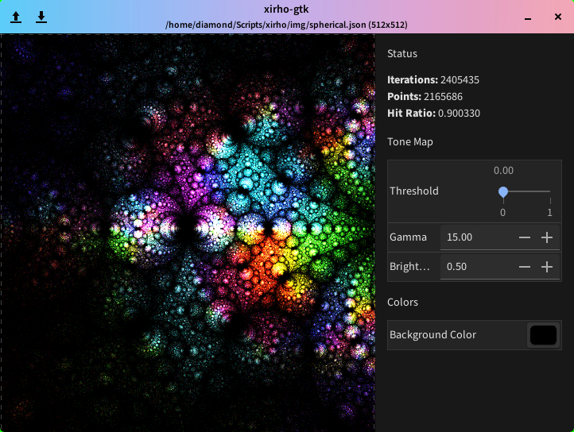

<h1 align="center">xirho-gtk</h1>

	<a href="https://github.com/zephyrtronium/xirho">xirho</a> GUI for GTK.

This project is a work-in-progress. As such, it is missing almost everything in
xirho. The current scope of this project is unclear.
